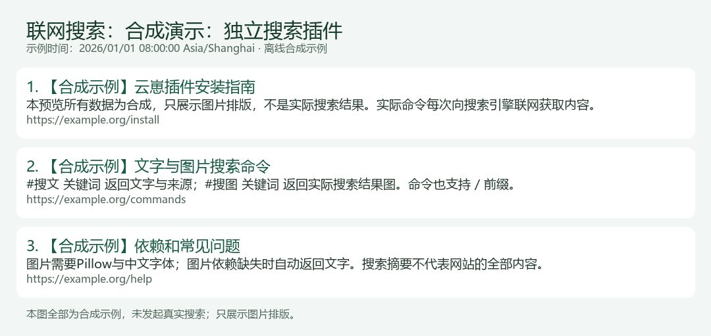

# YunzaiWebSearch · 联网搜索

发送一条命令，返回本次联网搜索的文字结果或图片。



## 命令

所有命令支持 `#` 和 `/`：

| 命令 | 功能 |
| --- | --- |
| `#搜索 关键词` | 自动选择文字或图片；股票、行情、指数、对比等优先图片 |
| `#搜文 关键词` | 搜索结果文字、摘要、时间、来源链接 |
| `#搜图 关键词` | 本次搜索结果图片 |
| `#搜索帮助` | 查看命令说明 |
| `#搜索诊断` | 仅主人检查 Python、Pillow 和字体；不会联网 |

示例：`/搜文 香港电话卡 内地使用 月租`、`#搜图 上证指数实时行情`。

每次向 Bing 请求搜索页，返回标题、摘要和来源链接。搜索引擎的索引和摘要可能滞后，搜索时间不等于来源内容或股票报价的更新时间。

## 支持范围与依赖

- 按云崽 V3 插件接口设计，支持具有 `lib/plugins/plugin.js`、`e.reply`、`e.isMaster`、全局 `segment.image` 的 TRSS-Yunzai、Miao-Yunzai 等兼容框架。
- Node.js 18.17+、Python 3.10+；文字搜索使用 Python 标准库。
- 图片需要 Pillow 和可用的中文字体；包内已包含 HTML 解析及图片渲染脚本，缺少图片依赖自动改发文字。
- 原生 Linux、Docker 内的 Linux 部署是主要支持场景。Windows 提供 Python 路径配置和中文字体自动识别，已进行离线解析/渲染及命令测试。
- 其他分支的兼容性以插件接口和安装检查为准。
- 服务器必须能访问 Bing。搜索引擎限制、验证码或网络异常会导致搜索失败。

## 安装：Ubuntu / Debian

在云崽根目录执行：

```bash
git clone https://github.com/719083594/yunzai-web-search.git plugins/yunzai-web-search
sudo node plugins/yunzai-web-search/scripts/install.mjs --install-deps
```

安装器只在明确传入 `--install-deps` 时安装发行版的 Python、Pillow、中文字体，生成被 Git 忽略的本地配置，不覆盖已有配置。**然后重启云崽**，发送 `#搜索帮助` 或 `#搜文 测试关键词`。

如果已经有 Python，可以不安装系统依赖，先用文字搜索：

```bash
node plugins/yunzai-web-search/scripts/install.mjs
```

安装脚本会提示图片依赖是否齐全。只复制 `index.js` 不够，请保留完整目录，尤其是 `lib/` 和 `renderer/`。

### ZIP、Docker、Windows

下载 [Releases 完整包](https://github.com/719083594/yunzai-web-search/releases)，将最外层 `yunzai-web-search` 文件夹完整放入云崽 `plugins` 目录，再运行安装器。Docker 的 Python/Pillow/字体必须在**机器人容器内**可用。

路径、容器镜像持久化、手动安装和 Windows 示例见 [完整安装说明](docs/INSTALL.md)。

## 配置

配置模板为 `config/plugin.example.json`，安装器生成 `config/plugin.json`。

| 字段 | 默认值 | 作用 |
| --- | --- | --- |
| `pythonPath` | Linux `python3`，Windows `python` | Python 可执行文件；只填文件路径，不带命令参数 |
| `fontPath` | 空 | 自动查找中文字体，也可填写字体文件路径 |
| `timeoutMs` | `26000` | 整次搜索上限，允许 1000～30000 毫秒 |
| `maxResults` | `5` | 文字结果条数，1～8；图片最多显示前4条 |
| `masterOnly` | `false` | 改为 `true` 后仅主人能使用全部命令 |
| `cooldownMs` | `5000` | 同一用户连续命令搜索的间隔 |
| `timeZone` | `Asia/Shanghai` | 搜索时间显示时区 |

默认普通用户和主人都能使用命令搜索及 GPT 联网搜索，`#搜索诊断` 始终仅主人可用。想按主人权限安装可用 `--master-only`。主人账号、权限、禁言和黑白名单由框架管理。

每个插件进程同时处理1次搜索，命令与可选工具共享并发限制，繁忙时提示稍后再试。私聊直接回复，群聊引用触发消息。结果在内存中处理，每次 Python 处理完成即退出。

## 可选：让 GPT 自动调用

兼容的 chatgpt-plugin / Chaite 可接入包内的 `integrations/chaite-tool.js`，让模型自行搜索，详情见 [可选 AI 接入](docs/AI-INTEGRATION.md)。只复制适配器文件通常还不够，需要在原生工具面板登记工具源码并启用对应工具组。

模型、人设、对话历史、聊天超时和工具调用由 GPT 插件配置。

## 更新、诊断与验证

```bash
git -C plugins/yunzai-web-search pull --ff-only
node plugins/yunzai-web-search/scripts/diagnose.mjs
# 可选：实际发起一次联网诊断
node plugins/yunzai-web-search/scripts/diagnose.mjs --network
```

更新后重启云崽。本地配置在 `.gitignore` 中，更新不会提交个人路径；不要用别人的配置覆盖自己的配置。安装器拒绝自动覆盖，明确重建才使用 `--force-config`。

测试覆盖命令、权限、引用、取消、并发、HTML 解析、链接过滤、图片渲染及依赖缺失时的回退。已在 Linux 容器中验证文字和图片搜索，细节见 [测试说明](docs/TESTING.md)。

## 非商业许可与隐私

采用 [PolyForm Noncommercial 1.0.0](LICENSE)：允许符合条款的非商业使用、复制、修改、分享，商业使用需另行取得权利人许可。再分发保留 `LICENSE` 与 `NOTICE`；以完整许可证为准。外部框架、Pillow 和字体各自保留自己的许可证，不包含在源码包中。

预览为合成示例。实际查询会传到 Bing；搜索结果和发送内容的留存受 QQ 和机器人框架配置影响，见 [隐私说明](SECURITY.md)。

## 插件列表信息

插件列表显示名称为 `YunzaiWebSearch`，包含本地图标、作者和功能介绍。安装目录可以沿用原名；显示名称不影响命令或配置路径。

## OrangeJuice 管理面板

插件提供 `orangejuice.plugin.json` 原生配置声明。安装橙汁后，在插件主页的“配置项”中编辑各项设置；保存后按页面提示重启机器人。
